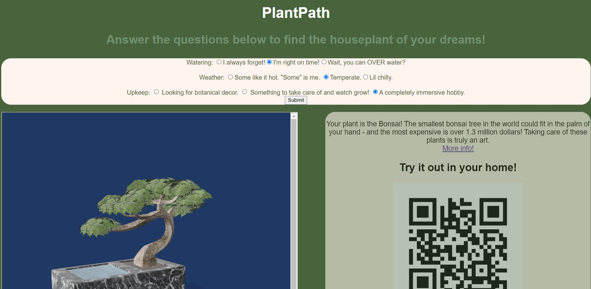
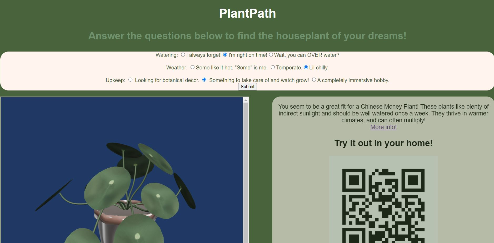

# React-echoAR-demo-House-Plants
React demo with echoAR.  Answer a few short questions to find a houseplant match, learn some info, and receive a QR code to see the plant in AR in your home!

## Register
Don't have an API key? Make sure to register for FREE at [echoAR](https://www.echoar.xyz/).

## Setup
1. Clone [echoAR-Houseplant-Demo](https://github.com/samia-mnn/echoAR-Houseplant-Demo/)
2. Download [Node and Node Package Manager(npm)](https://nodejs.org/en/)
3. [Download and set up ngrok](https://ngrok.com/download)

### Terminal
4. In the terminal, navigate to the ```echoAR-Houseplant-Demo/``` directory and enter ```$ npm init```
5. Next, enter ```$ npm install express react react-dom``` to install relevant packages

### echoAR Console
6. Add each of the houseplants to your echoAR console. Use the search function and type in the plant name to find the model you would like to use for each plant.

These are the models we used : 
(Filename Author)
  
- Anthurium.glb thesidekick
  
- Chinese Money Plant.glb daniel
  
- Umbrella palm tree.glb  Poly by Google
  
- ZZ Plant.glb Jack Irwin Miller
  
- Bonsai Tree.glb zacharyfrs
  
- Orchid.glb Poly by Google
  
- Snake Plant (Highest Resolution, Unbounded).glb legel

7. Copy the links of the QRImage links, and place them into the "findplantInfo" function in [PlantForm.jsx].

8. Once the houseplant models are added, copy the short URL generated for each model and use them to replace the ```[shortUrl]``` in the "findplantInfo" function [PlantForm.jsx]

9. Choose a plant to be your default and copy its QRImage link and shortURL into [index.html]

## Run
1. In terminal, enter ```npm start``` to serve the application on a local host. The terminal will display a port number that you can use in the next steps
2. In a separate terminal window navigate to ```<path>/<to>/ngrok``` and enter ```http <port number>```. The terminal will list a number of urls - the important one is the url beginning with  ```https```
3. To view on computer or mobile device, open up web browser and enter the ngrok url.


## Learn More
Refer to our [documentation](https://docs.echoar.xyz/unity/) to learn more about how to use Unity and echoAR.

## Support
Feel free to reach out at [support@echoAR.xyz](support@echoAR.xyz) or join our [support channel on Slack](https://join.slack.com/t/echoar/shared_invite/enQtNTg4NjI5NjM3OTc1LWU1M2M2MTNlNTM3NGY1YTUxYmY3ZDNjNTc3YjA5M2QyNGZiOTgzMjVmZWZmZmFjNGJjYTcxZjhhNzk3YjNhNjE).

## Screenshots



Demo created by [Samia Menon](https://github.com/samia-mnn/).

